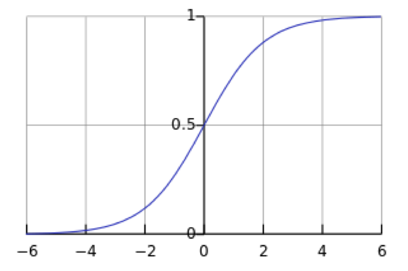

# logistic regression

## 知识准备

### 基础数学知识

#### sigmoid 函数(logistic function)
$$
  g(x) = \frac{1}{1+e^{-x}}

$$
对应的数学曲线如下：


#### log loss function
$$
L(Y,P(Y|X)) = -logP(Y|X)

$$

## 理论模型

#### 预测函数

在线性回归中，预测函数为$h_\theta(x)=\theta^Tx$。因为线性回归中的值是连续的，所以预测函数可以很好的拟合。但是在分类问题中，数据是离散的，且$y\in{0,1}$,所以不能使用之前的预测函数，而是用 $h_\theta(x)=g(\theta^Tx)$ 代替。

至于为什么用在sigmoid函数，因为它的范围在0,1之间，而且曲线平滑。当然，选择这个函数还有更深层次的原因，可以见后面的扩展GLM。

#### 决策函数

决策函数一般为
$$
y = 1\ if\  P(y=1|x)>0.5
$$
这里的0.5是一个阈值，可以改变。

#### 损失函数
我们定义了概率函数如下，很明显是一个伯努利分布。
$$
p(y=1|x) = g(\theta^Tx) = \frac{1}{1+e^{-\theta^Tx}}
$$

因此
$$
p(y|x) = h_\theta(x)^y + (1-h_\theta(x))^{1-y}
$$
假设样本独立，则可以得到似然函数如下：
$$
\begin{align}
L(\theta) &= \prod_{i=1}^{m}p(y^i|x^i;\theta)\\
          &= \prod_{i=1}^{m}(h_\theta(x)^y + (1-h_\theta(x))^{1-y})      
\end{align}
$$
取对数可以得到对数似然：
$$
l(\theta) = \sum_{i=1}^m(ylog(h_\theta(x)+(1-y)(1-h_\theta(x))))
$$

回顾线性回归，我们使用最小二乘法来得到损失函数$J(\theta)$。在这里，依旧要定义损失函数。常用的损失函数有0-1损失，log损失，hinge损失等。
逻辑回归使用的是log损失函数，得到:
$$
J(\theta) = - \frac{1}{N}l(\theta)
$$

所以最小化损失函数，即最大化对数似然，也就是最大似然求解：
$$
\theta = arg \ min\  \sum_{i=1}^m(ylog(h_\theta(x))+(1-y)(1-h_\theta(x)))
$$

####参数求解

求解 $\theta$的过程和线性回归类似，常用的有gradient_descent。此外，常见的凸优化方法都可以求解该问题，比如共轭梯度下降，牛顿法，LBFGS等。这里介绍gradient_descent的解法。

$$
\begin{align}
\frac{\delta}{\delta\theta_j}J(\theta) &= 1/m
\frac{\delta}{\delta\theta_j}\sum_{i=1}^m(ylog(h_\theta(x))+(1-y)(1-h_\theta(x))) \\
&=1/m\sum_{i=1}^m(\frac{y}{h_\theta(x)}+\frac{y-1}{1-h_\theta(x)})\frac{\delta}{\delta\theta_j}h_\theta(x) \\
&= 1/m\sum_{i=1}^m(\frac{y-h_\theta(x)}{(1-h_\theta(x))h_\theta(x)})
\frac{\delta}{\delta\theta_j}h_\theta(x) \\
\end{align}
$$

因为

$$
\begin{align}
\frac{\delta}{\delta\theta_j}h_\theta(x) &=
\frac{\delta}{\delta\theta_j}g(\theta^Tx) \\
&= g(\theta^Tx)(1-g(\theta^Tx))\frac{\delta}{\delta\theta_j}(\theta^Tx) \\
&= g(\theta^Tx)(1-g(\theta^Tx))x_j \\
&= h_\theta(x)(1-h_\theta(x))x_j

\end{align}
$$

所以
$$
\frac{\delta}{\delta\theta_j}J(\theta) =
1/m\sum_{i=1}^m(y-h_\theta(x))x_j

$$

我们可以发现，这个结果和我们之前线性回归的结果一样。因此，这里直接使用上次的结果：
$$
\frac{\delta}{\delta\theta}J(\theta) =
1/m(X^TX\theta - X^Ty)
$$

所以根据gradient descent：
$$
  for \;i \;in \;range(niteration):\\
      \qquad \theta = \theta - \alpha/m\;X^T(X\theta - y)
$$

### 可能会出现的疑惑

为什么线性回归和逻辑回归 $\theta$的偏导结果一致，为什么选择sigmoid函数。和线性回归中的疑惑：为什么选择最小二乘法作为损失函数一致，都可以在andrew ng的讲义中得到解释，这部分内容较为复杂，这里不再赘述。

> 但是我还是要讲一下，损失函数选择与模型服从的分布有关，这两个模型服从的分布不一致，线性回归模型数据服从高斯分布（正态分布），逻辑回归模型数据服从伯努利分布（0-1分布），然后都用最大似然求解（对于损失函数）。而偏导一致的原因是，他们都是广义线性分布的例子。

## python 代码实现
和线性回归一致，这里依旧是最基础的实现，没有涉及其他优化方法和正规化。
```python
import numpy as np
import pandas as pd

def sigmoid(X):
    return 1 / (1 + np.exp(-X))
class LogisticRegression:

    def __init__(self,n_iterations = 10, learning_rate=0.01):
        self.params = None
        self.n_iterations = n_iterations
        self.learning_rate = learning_rate

    def fit(self, X, y):
        X = np.insert(X,0,1,axis=1)
        n_features = np.shape(X)[1]
        self.params = np.random.random((n_features,))

        for _ in range(self.n_iterations):
            y_pred = sigmoid(X.dot(self.params))

            self.params += self.learning_rate * X.T.dot(y-y_pred)


    def predict(self,X):
        X = np.insert(X,0,1,axis=1)
        y_pred = np.round(sigmoid(X.dot(self.params))).astype(int)

        return y_pred
```

## 扩展

### generalized model and discriminative model(生成模型和判别模型)

### Generalized Linear Model(广义线性模型)

## 参考资料
1. [Andrew Ng 关于Linear regression和logistic Regression的讲义](http://cs229.stanford.edu/notes/cs229-notes1.pdf)
2. [一篇讲的不错的文章](http://tech.meituan.com/intro_to_logistic_regression.html)
3. [wiki_logisticRegression(虽然好像没用到)](https://en.wikipedia.org/wiki/Logistic_regression)
